# Dash Bookmark Manager Chrome Extension

## Title
Dash Bookmark Manager

## Overview

Dash Bookmark Manager is a lightweight and intuitive extension that streamlines your browsing experience by allowing you to search, delete, and manage bookmarks, duplicates, and empty folders, export tabs, and customize settings.

## Extension Summary
Search and delete bookmarks, duplicates, and empty folders (individually or in bulk), plus export tabs, and customize settings.

## Single Purpose Description
Dash Bookmark Manager is a versatile tool crafted to help users efficiently manage their Chrome bookmarks. Its primary focus is to detect, display, and manage bookmarks, duplicate bookmarks, and empty folders, export tabs with Tab Cleanup, supports Dark/Light Mode, and customize settings via the Settings Page, empowering users to effortlessly clean and organize their browser bookmarks. By prioritizing user privacy, the extension exclusively targets bookmark management, ensuring no access to or processing of sensitive data or services.

## Key Features

- **Bookmarks**: Quickly search, delete, and manage bookmarks, individually or in bulk.
- **Duplicate Bookmarks**: Quickly detect and remove duplicate bookmarks, individually or in bulk.
- **Empty Folders**: Quickly locate and delete empty folders in your bookmark library, individually or in bulk.
- **Tab Cleanup**: Export tabs as bookmarks and close them all for a clean browser start.
- **Dark/Light Mode**: Switch seamlessly between a sleek dark mode and a bright light mode to customize your extension experience.
- **Settings Page**: Access a dedicated settings page to tailor the Bookmark Manager to your preferences.

Designed to simplify bookmark management and enhance productivity for all users.

Note: This extension only supports Chrome 114 and above, and may not support other browsers.

## Category
Tools

## Language
English

## Public GIT Repository
https://github.com/siddharthdashore/DashBookmarkManager

## Data Handling

**We do not collect, store, or share any personal user data.** All bookmark processing is performed locally on your device, ensuring your data remains private and secure.

## Permissions Required

The following permissions are required to deliver an efficient, seamless experience for managing your Chrome bookmarks and tabs:

* **Bookmarks:** The extension needs access to Chrome bookmarks to detect and manage duplicates or empty folders, read, and modify bookmarks, allowing users to organize and manage their bookmarks directly while ensuring privacy.
* **Tabs:** The extension needs access to Chrome tabs to export their titles and URLs as bookmarks, allowing users to close all tabs for a clean browser start while preserving their important pages and ensuring privacy.

## Are you using remote code?
No, I am not using Remote code

## Payments
Free of charge

## Visibility
Public

## Distribution
All regions

## Type
Non-trader

## Screenshots
- Up to a maximum of 5
- 1280x800 or 640x400
- JPEG or 24-bit PNG (no alpha)
- At least one is required
- Edit Screenshots [Reference](https://www.photopea.com)

### Chrome Screenshot Home:
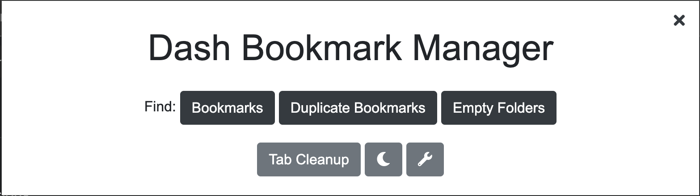
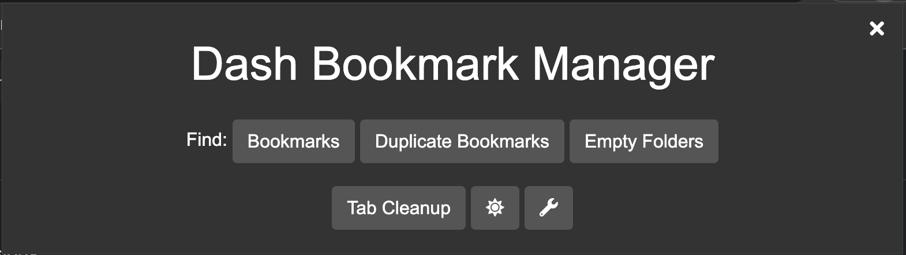

### Chrome Screenshot Bookmarks Page:
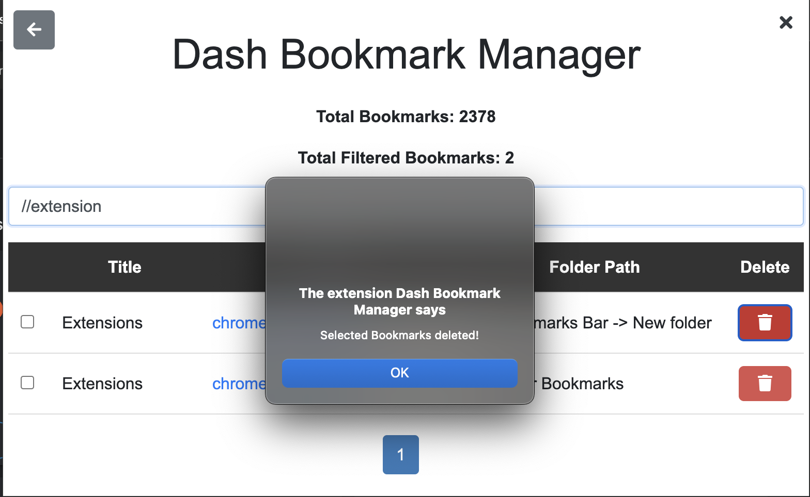
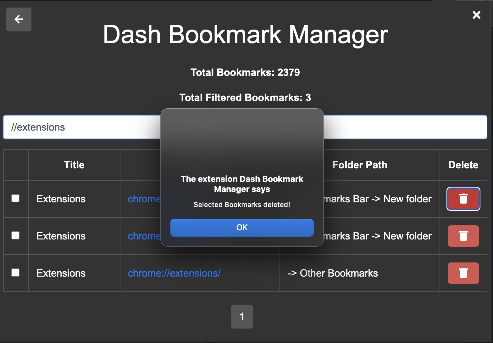

### Chrome Screenshot Duplicate Bookmarks Page:
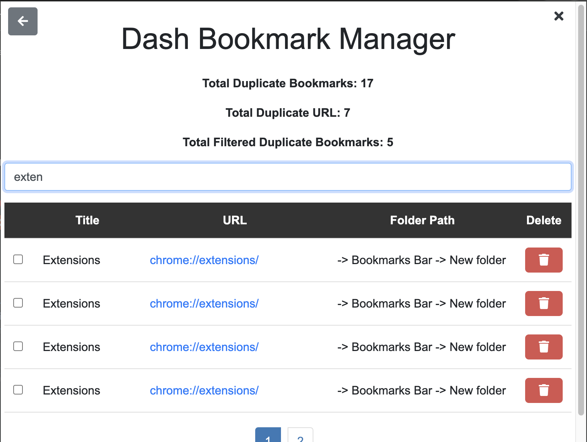
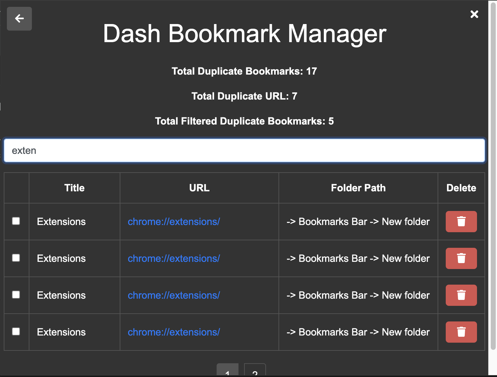
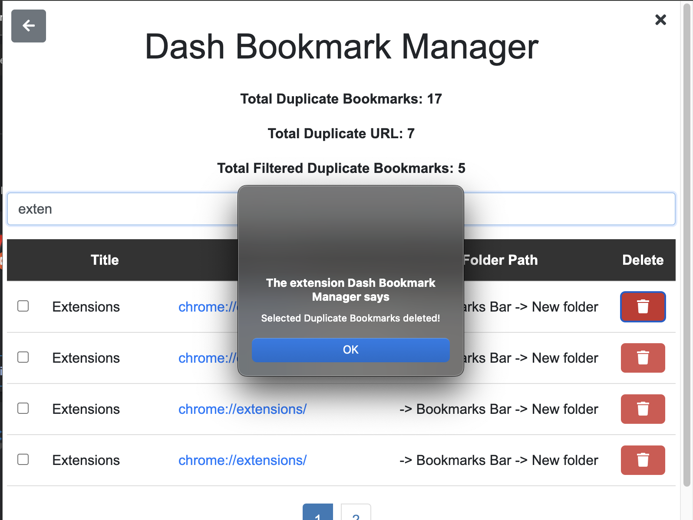
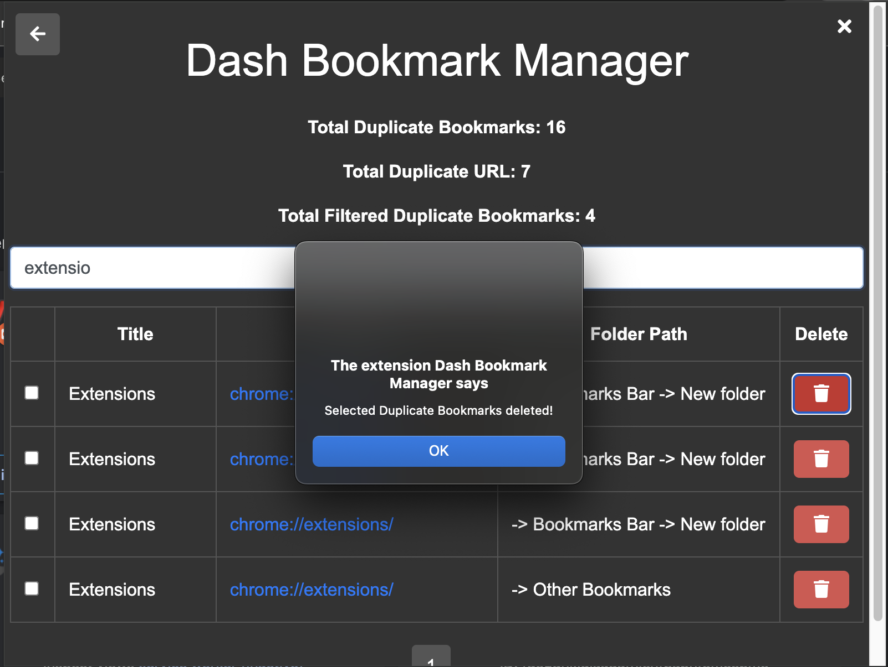

### Chrome Screenshot Empty Folders Page:
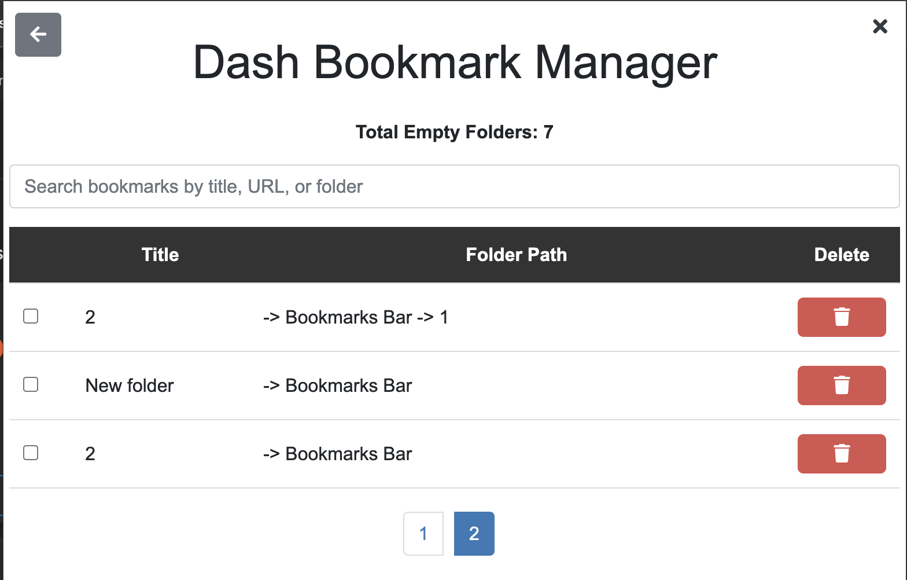
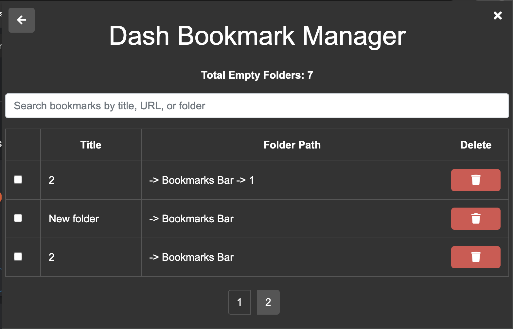
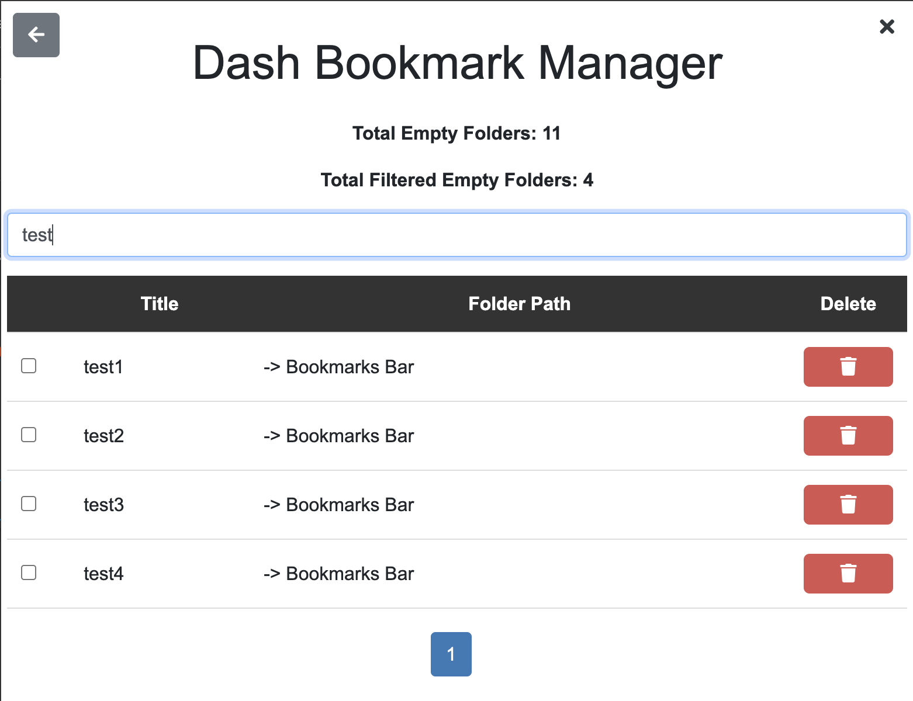
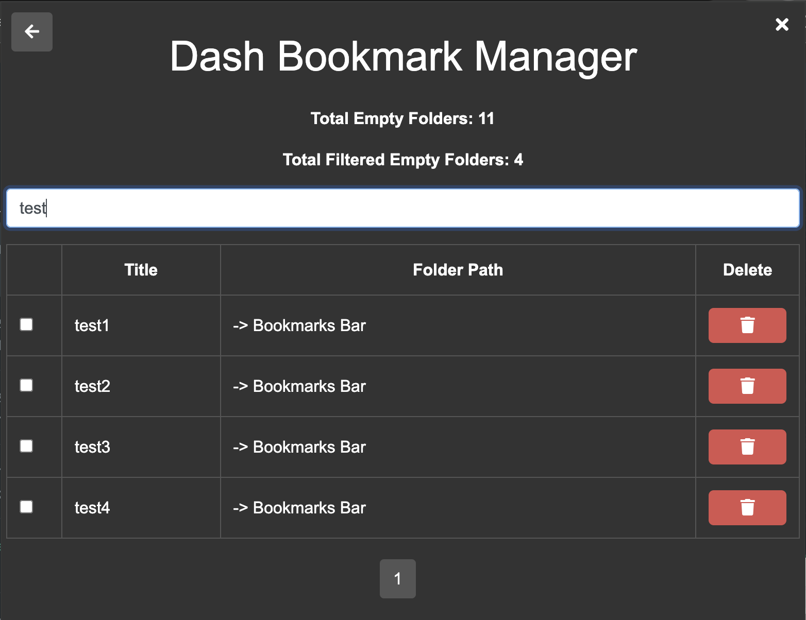

### Chrome Screenshot Settings Page:
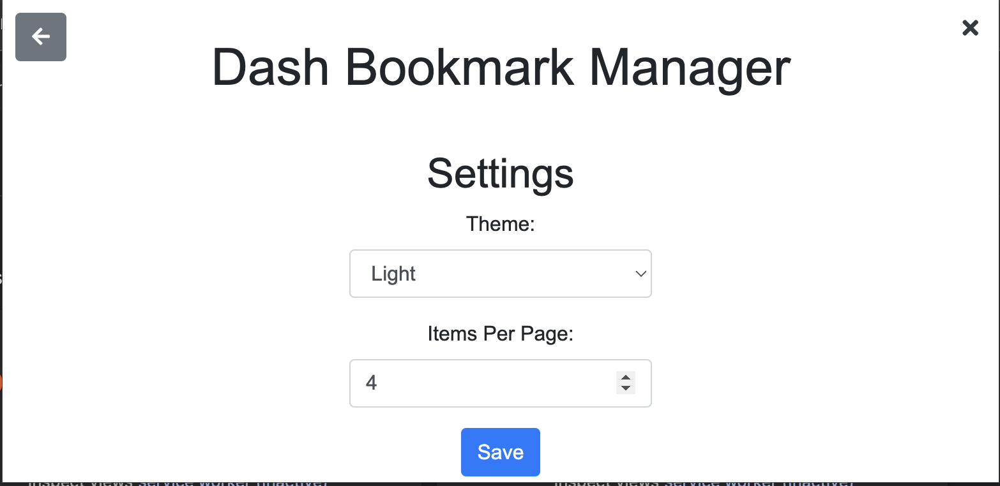
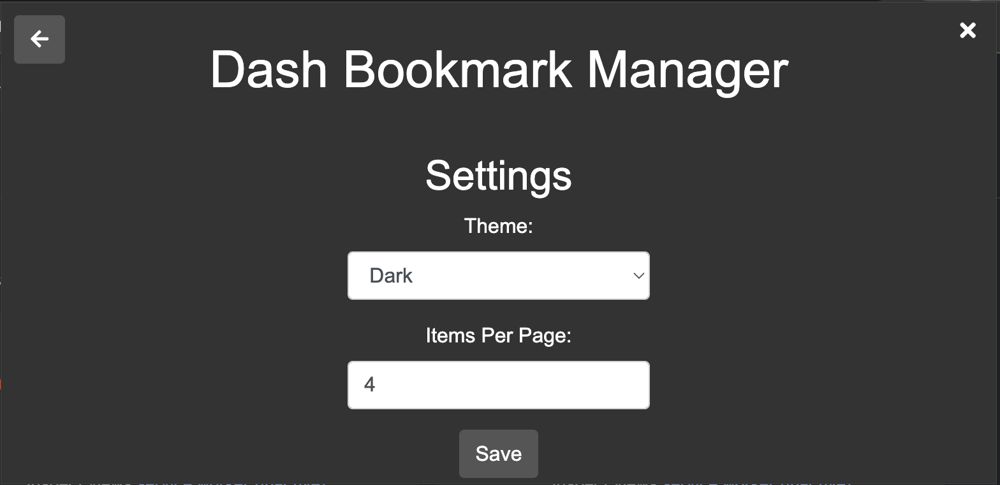

## Small promo tile (Optional)
- 440x280 Canvas
- JPEG or 24-bit PNG (no alpha)

Not Available

## Marquee promo tile (Optional)
- 1400x560 Canvas
- JPEG or 24-bit PNG (no alpha)

Not Available

## Contact Us

If you have any questions or concerns about this Privacy Policy, please feel free to contact us at [siddharthdashore26@gmail.com](mailto:siddharthdashore26@gmail.com).

## Copyright

&copy; 2025 Dash Bookmark Manager. All rights reserved.

Visit our [www.SiddharthDashore.com](https://siddharthdashore.com/) for more information.